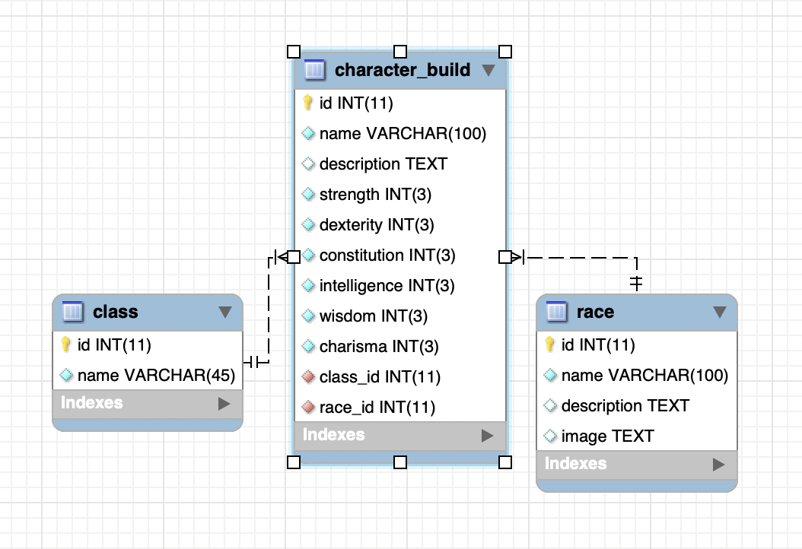

# JPACRUDProject
## Description
This program uses JPA and Spring Boot to create a web application that can perform CRUD operations on a database for fantasy character builds. The application has four main functions that are able to be navigated to from the navigation bar located at the top of every page. This program utilizes 3 main entities that depict the 3 tables from the underlying database that make this application possible. Those tables are the character_build, race, and class tables.

The 'Find' webpage allows a user to input an id number for a character build, and if it is a valid character build it will bring up the full information for that character build. If no result is found, the user is notified of such.

The 'Create' webpage allows a user to create a new character build using a form. There is an option to pick every aspect of a character, and every field is a required field due to the nature of a character build. Once created, the user either sees the information of the created character build on the results page, or the user is informed that the created of the character build has failed.

The 'Update' webpage allows a user to update an existing character build and all of its properties. Once updated, the user either sees the updated information for the character build, or the user is informed that the update has failed.

The 'Delete' webpage allows a user to delete an existing character build. This option needs a user to enter the ID of a character build, and all character builds currently in the database are displayed below the form for ease of use. Once deleted, the user is either show the information of the deleted build, or the user is notified that the character build deletion has failed.

The home, create, update, and delete webpages all display every character build in the database under their respective forms. All of these displays have hyperlinks on the build names for their associated actions except for the 'Delete' webpage. This is intentional in order to prevent the unintentional deletion of builds.

## Entity Relations Diagram
[]

## Lessons Learned
There were many iterations of this project as I refined and refactored the application to show properly. The many iterations provided some great practice for styling and formatting the controller and JSP files so that they were more readable.

A great lesson learned here was how to tie tables together effectively and make sure that they interact with each other correctly. The three database tables used in this web application are all connected, with the race and class tables having a foreign key in the character_build table. This connection allows for the effective use of entities, but it also proved to be a bit difficult in getting information from the entity to the JSP's. It took some magic and practice to get everything running correctly.

Overall, this was a fun project that allowed for creating something relevant and meaningful to me while furthering an understanding of Spring Boot, JPA, and SQL database CRUD operations.

## Technologies Used
* Java
* SQL, mySQL, JDQL
* HTML, CSS
* JSP
* JPA
* Spring Boot, Spring MVC
* ORM Design Patterns
* DAO Design Patterns
